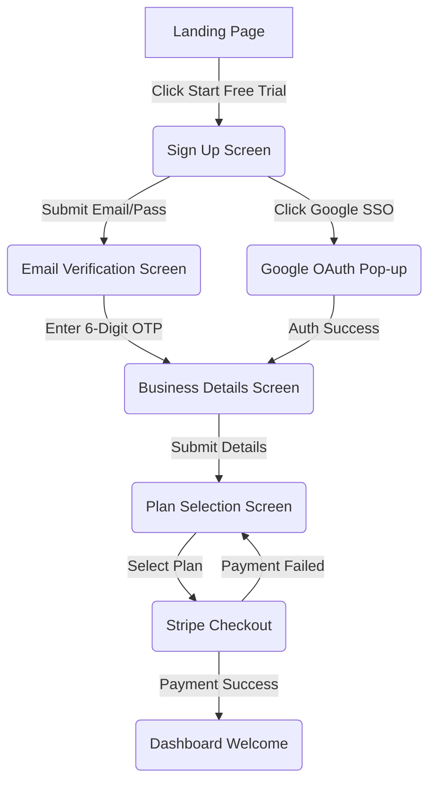

# Screen Flow: Business Onboarding

## Detailed Transitions
1. **Sign Up Screen -> Email Verification Screen**: Route transition (`/verify-email`). Requires `email` state passed via context or query param.
2. **Email Verification Screen -> Business Details Screen**: Route transition (`/onboarding/business-details`). Triggered automatically on 6th keystroke if valid.
3. **Business Details Screen -> Plan Selection Screen**: Route transition (`/onboarding/plans`).
4. **Plan Selection Screen -> Stripe Checkout**: External redirect. System must create Stripe Customer and Checkout Session, passing the `organizationId` as `client_reference_id`.
5. **Stripe Checkout -> Dashboard Welcome**: Redirect back to app (`/dashboard?onboarding=success`). Triggered by Stripe success URL configuration.
