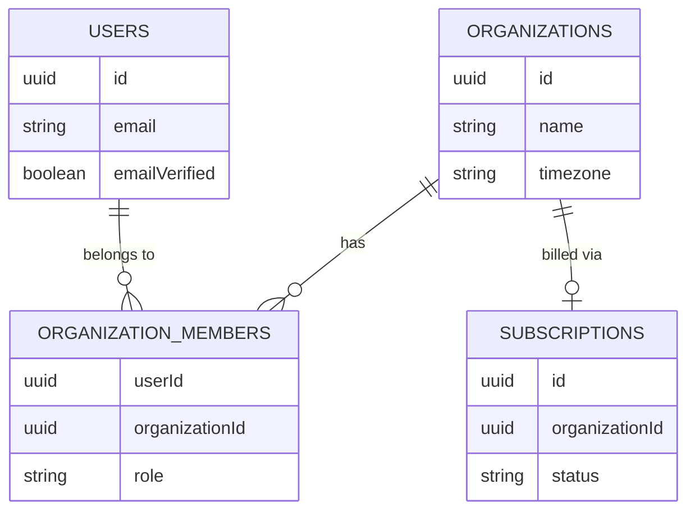

# Relationships: Business Onboarding

## Explanation
1. A **User** can theoretically belong to multiple **Organizations** (e.g., a manager handling two different clinics), hence the many-to-many relationship bridged by `organizationMembers`. However, during the initial onboarding flow, it creates a 1:1 relationship as the User creates their first Organization.
2. An **Organization** must have exactly one active **Subscription** to permit access to the dashboard. The subscription record is linked via `organizationId`.
