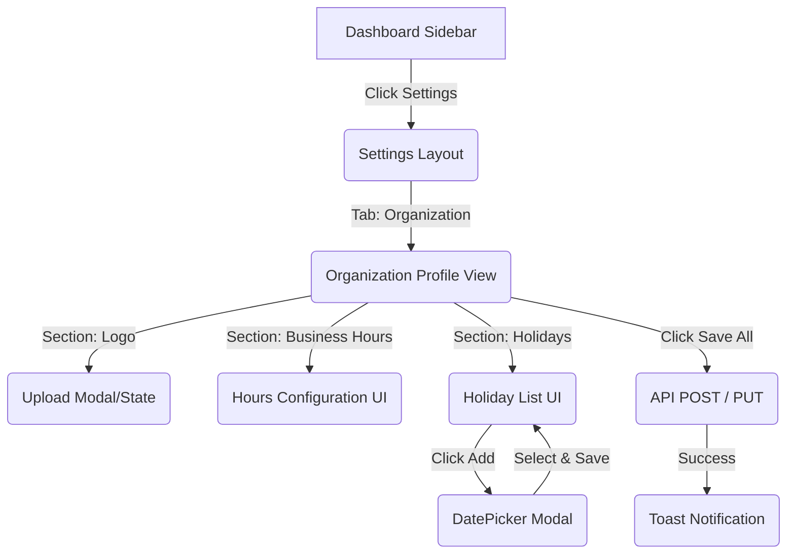

# Screen Flow: Organization Management

## Detailed Transitions
1. **Sidebar -> Organization View**: Client-side navigation (`/settings/organization`). Page fetches data via React Query/SWR.
2. **Uploading Logo**: Clicking the avatar circle opens the native OS file picker. Selecting a file initiates an immediate background upload to S3/Cloud Storage, replacing the image preview optimistically.
3. **Adding a Holiday**: Opens a small popover or modal. Requires a date and a string label. Saving adds it to local state. User must hit the main "Save Changes" button to persist to DB.
