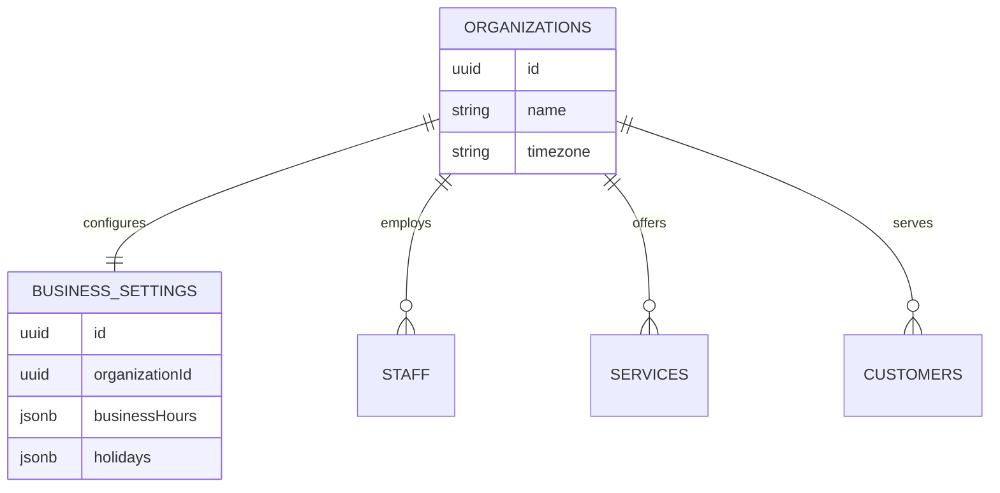

# Relationships: Organization Management

## Explanation
- The `businessSettings` table is strictly 1:1 with `organizations`.
- Every major entity in the platform (Staff, Services, Customers) holds an `organizationId` foreign key. The `organizations` table is the absolute root of the multi-tenant architecture. When an organization is deleted, all cascaded data must be purged.
