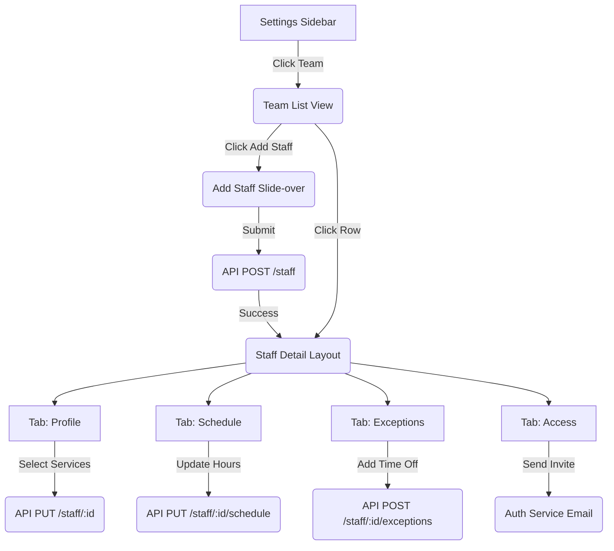

# Screen Flow: Team Management

## Detailed Transitions
1. **List to Detail**: Uses Next.js dynamic routing (`/settings/team/[staffId]`). The detail view has a sub-navigation component for the 4 tabs.
2. **Access Tab Interactions**:
   - If `userId` is null, show the "Invite" form.
   - If `userId` exists, show the "Role Management" form and the User's last login timestamp.
