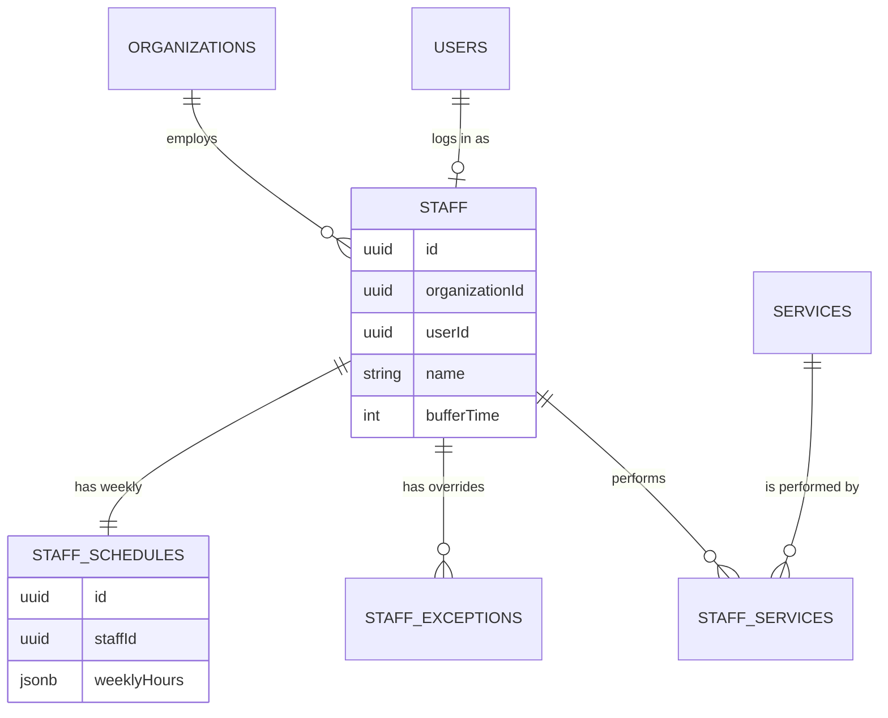

# Relationships: Team Management

## Explanation
- **User vs Staff**: The `users` table handles authentication, passwords, and billing. The `staff` table handles calendar representation. A `User` can exist without being `Staff` (e.g. an Owner who doesn't take appointments), and `Staff` can exist without being a `User` (e.g. a physical room).
- **Service Mapping**: The junction table `staffServices` is heavily queried by the AI to filter which providers are valid for the user's requested service.
