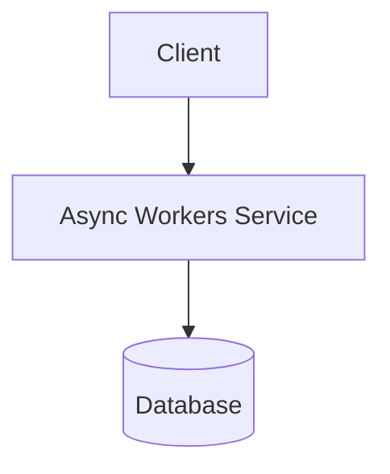
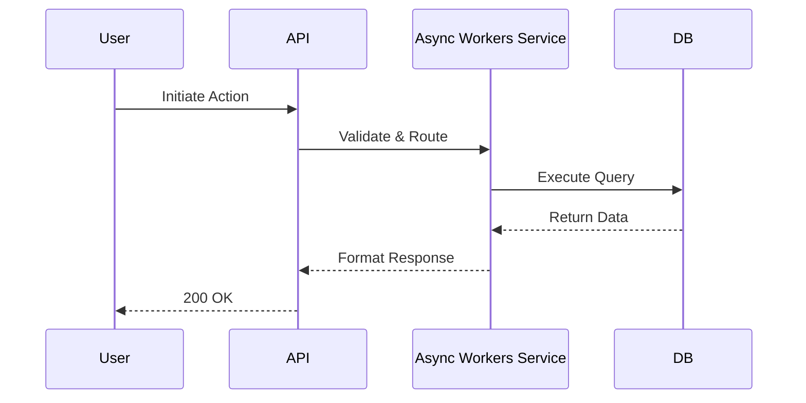

# Background Jobs

## Purpose
Defines the structural architecture, responsibilities, and flows for the Async Workers within the Enterprise Multi-Tenant AI Receptionist SaaS platform.

## Architecture Diagram

## Responsibilities
- Handle all core operations for Async Workers.
- Ensure tenant isolation and security boundaries.
- Provide highly available processing for the platform.

## Dependencies
- PostgreSQL (Drizzle ORM)
- AI SDK
- Vercel Edge Network

## Data Flow
1. Request enters via Vercel Edge Network.
2. Middleware validates Tenant ID and Authentication.
3. Payload routed to Async Workers Controller.
4. Drizzle ORM executes transaction against PostgreSQL.
5. Result returned to client.

## Sequence Diagrams

## Edge Cases
- **High Latency**: Graceful degradation when dependent services slow down.
- **Invalid Tenant ID**: Immediate 403 Forbidden rejection.
- **Data Collision**: Optimistic concurrency control using `updated_at` timestamps.

## Tradeoffs
- **Consistency vs Availability**: Favoring immediate consistency for core records, eventual consistency for analytics.
- **Compute vs Storage**: Caching heavy computational results in Redis at the cost of memory.

## Design Decisions
- Chosen Drizzle ORM over Prisma for Edge compatibility on Vercel and zero cold-start overhead.
- Used PostgreSQL Row Level Security (RLS) as a secondary defense layer for multi-tenancy.

## Scalability
- Stateless compute tier scales horizontally on Vercel automatically.
- Database reads scaled via read-replicas.
- Heavy operations offloaded to background jobs.

## Failure Recovery
- Automatic retries with exponential backoff for AI/External API calls.
- Point-in-time recovery (PITR) enabled on PostgreSQL.
- Circuit breakers prevent cascading failures.

## Security Considerations
- All data encrypted at rest and in transit (TLS 1.3).
- Strict Role-Based Access Control (RBAC) enforced at the API layer.
- Tenant ID isolation enforced at the database level.

## Future Expansion
- Transition to a microservices architecture if team size exceeds 50 engineers.
- Implementing multi-region deployments for global latency reduction.
- Adding advanced anomaly detection using internal AI models.
